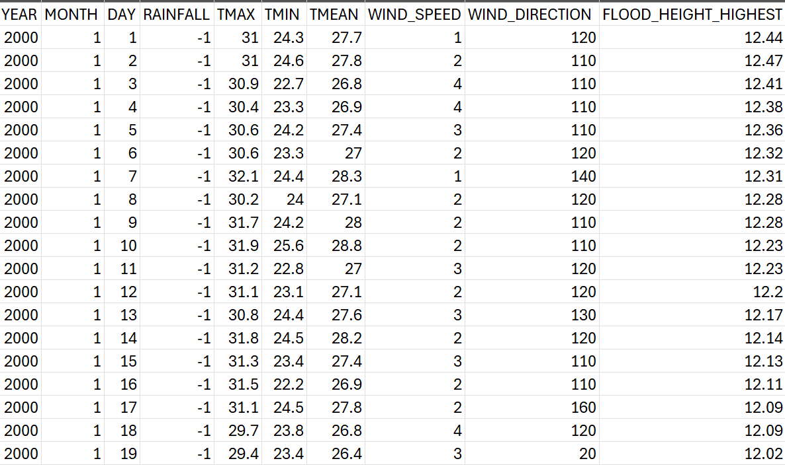
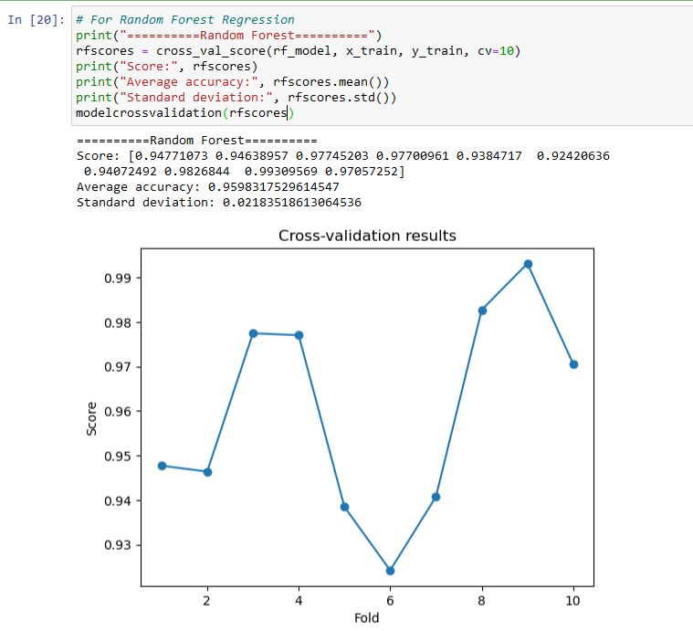
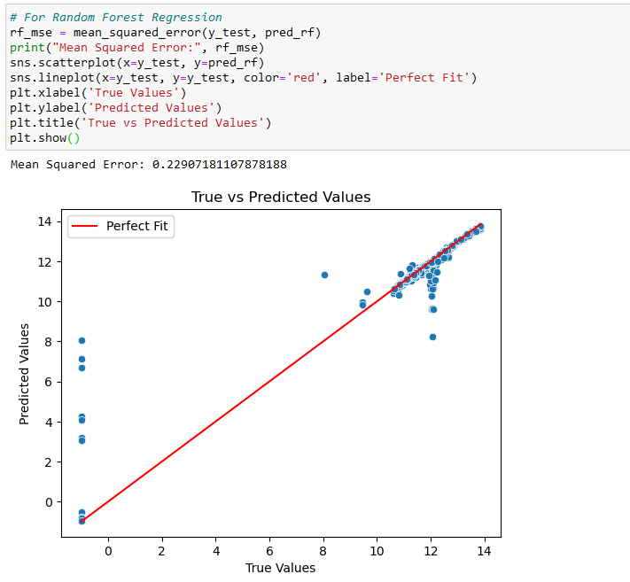
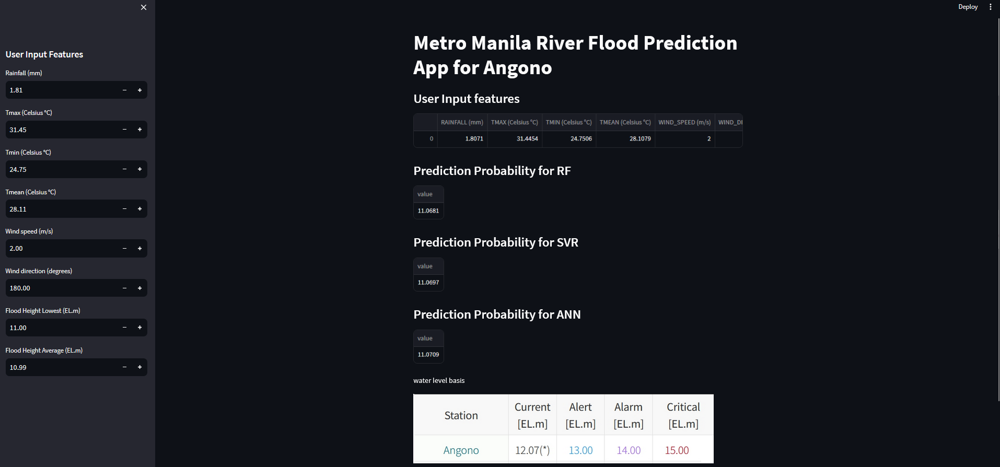

# A Comparative Study Using Machine Learning and Flood Data to Predict Floods
This is my undergraduate thesis which I did along with two of my groupmates in Ateneo de Naga University.
## Objective 
Do a comparative study of machine learning algorithms to predict river and urban flood height using weather data and flood reports from various local government agencies in the Philippines.

## Methods Used
* Data was gathered in goverment agencies throughout Metro Manila such as Metropolitan Manila Development Authority (MMDA), Effective Flood Control Operation System (EFCOS), and Philippine Atmospheric, Geophysical and Astronomical Services Administration (PAG-ASA)
[CSV Preview](https://github.com/AlfonsoAlik/EFCOS-MMDA-File/blob/main/Angono/Angono_NAIA_Consolidated_Data.csv)

[Jupyter Notebook](jupyter%20notebooks/flood-data-with-svm-efcos-Angono.ipynb)
* python was used to implement the algorithms. In addition, visualizations were also done using matplotlib and seaborn

* The evaluation methodologies used for the models are Cross-Validation and Linear Regression showing the standard deviation, average score accuracy, and mean squared error to fully determine which of the algorithms were effective

* We used open-source Python framework which is steamlit to create an application which shows the possible flood height depending on the precipitation

## Result
*The result show that Random Forest is the most effective machine learning model using the Philippine data. In urban flood prediction, RF displayed the highest accuracy at 61% while having a low mean squared error of 31 making it the most balanced model than the others. Similarly, RF demonstrated the highest average accuracy at 99.9511% in five rivers while maintaining the lowest mean squared error across seven rivers out of nine.

contains all of the codes, jupyter notebooks and csv files used for the research

## User Manual

How to run the web application:
1. download first anaconda on this website: https://www.anaconda.com/download, streamlit on this website: https://docs.streamlit.io/library/get-started/installation, and python on this website https://www.python.org/downloads/ for the web application to work
2. download any of the folders in the github link on the appendix C
3. open anaconda prompt and direct the link to the project
4. run poc_efcos in the command prompt by typing: "python poc_efcos.py" on the EFCOS files or  "python run poc.py" without the quotation marks for the MMDA files. If you want to change the dataset to your own, you can change the line: df = pd.read_csv('Montalban_ScienceGarden_Consolidated.csv') to your own csv file.
5. run app_efcos.
6. You can now view the results on the web application

Additional notes: see pdf file for the research.
